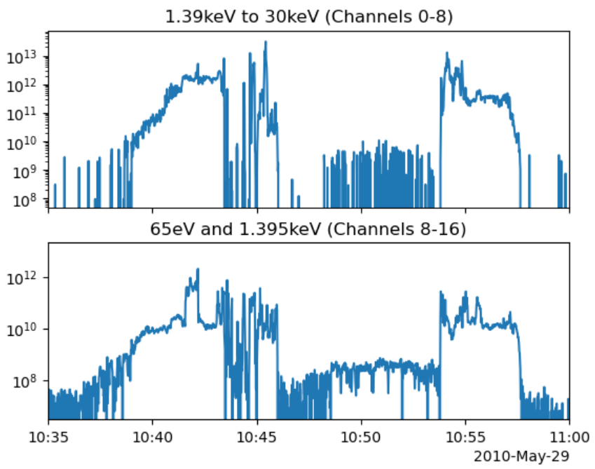

Summer 2025

---
# Test Header
## Subheader 1
This a a cool section
## Subheader 2
Let's test out Latex integration
$$\nabla \cdot \vec{E} = \frac{\rho}{\epsilon_{0}}$$
Yep! That works.

How about images: 

Looks pretty good!