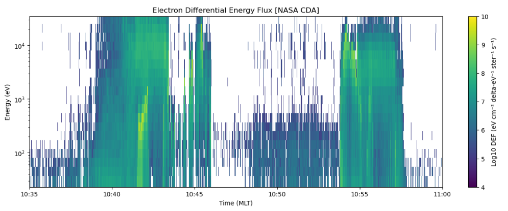
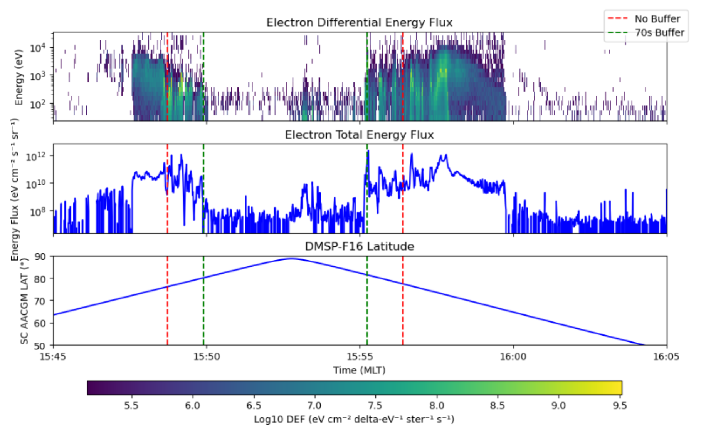
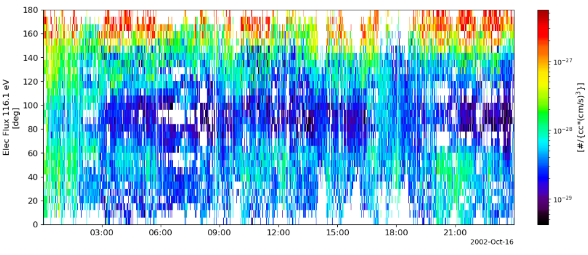

June 2026

---
# Introduction
These are my brief notes on the theory behind distribution functions, energy/number fluxes, and data products from spacecraft electrostatic analyzers
# Distribution Functions
A **distribution function** describes particle distribution in phase space

$$f(\mathbf{r},\mathbf{v},t)$$

and has units of $\text{m}^{-3} (\text{m/s})^{-3} = \text{m}^{-6}\text{s}^3$. If location is fixed, 

$$f(\mathbf{v})$$

gives the amount of particles moving with velocity $\mathbf{v}$. **Number density** is given by

$$n = \int f(\mathbf{v})\,d^3v$$

And **bulk velocity** is given by 

$$\mathbf{u}= \frac{\int \mathbf{v}f(\mathbf{v})\,d^3v}{\int f(\mathbf{v})\,d^3v}$$

# Number and Energy Flux
Velocity can also be described in **spherical coordinates**:

$$d^3\mathbf{v} = v^2\sin \alpha \,dv\,d\alpha\,d\gamma$$

>where $\alpha$ is defined as the **pitch angle** and $\gamma$ is the **gyrophase angle**. Often we assume uniform gyrophase.

We also define $d\Omega =\sin \alpha \, d\alpha\,d\gamma$ so that

$$d^3\mathbf{v} = v^2\,dv\,d\Omega$$

Speed can be described in terms of **particle energy** $E=\frac{1}{2}mv^2$ so that 

$$v^2 =\frac{2E}{m} \quad \text{and} \quad dv  = \frac{dE}{\sqrt{ 2Em }}$$

> since electrostatic analyzers sort particles by energy, we often work in terms of energy

and thus

$$d^3v = \frac{2E}{m} \frac{dE}{\sqrt{ 2Em }}\,d\Omega = \frac{\sqrt{ 2E }}{m^{3/2}}\,dE\,d\Omega$$

 For now, let's assume $f$ is only a function of speed (and time). We define $\tilde{f}(E)$ as
 
$$\tilde{f}(E)= \frac{\sqrt{ 2E }}{m^{3/2}}f(v)$$

>where $\tilde{f}(E)$ has units of $\text{m}^{-3}\,\text{eV}^{-1}\,\text{ster}^{-1}$

so that **number density** can be derived from

$$n = \iint \tilde{f}(E) \, d\Omega\,  dE$$

## Differential Fluxes
**Differential number flux** $j(E)$ is defined as

$$\boxed{j(E) = v\tilde{f}(E) = \frac{2E}{m^2}f(v)}$$

Usually, the length scales are in terms of $\text{cm}$ rather than $m$ so that the units are

$$\frac{\text{particles}}{\text{cm}^2\,\text{s}\,\text{ster}\,\text{eV}}$$

> It is defined such that the number of particles crossing an area $dA$ is $j(E)\,dE\,dA\,dt\,d\Omega$

**Differential energy flux** $\tilde{j}(E)$ is just 

$$\boxed{\tilde{j}(E) = E\cdot j(E)}$$

this has units of 

$$\frac{\text{eV}}{\text{cm}^2\,\text{s}\,\text{ster}\,\text{eV}}$$

>This is the energy arriving per unit area, per time, per solid angle, per energy

Differential energy flux measurements are commonly used to characterize **precipitating particle populations in the upper ionosphere**. An example is given by Figure 1.

>Figure 1. Differential energy flux from the Defense Meteorological Satellite Program (DMSP) and its Special Sensor J5 (SSJ/5)

## Integrated Fluxes
**Integrated number flux** is defined as

$$\boxed{\Phi=\int j(E)\,dE}$$

This has units of 

$$\frac{\text{particles}}{\text{cm}^2\, \text{s}\,\text{ster}}$$

and **integrated energy flux** is

$$\boxed{Q = \int E\, j(E)\,dE}$$

with units of

$$\frac{\text{eV}}{\text{cm}^2\,\text{s}\,\text{ster}}$$

If integrated over all energy channels, they are called total energy flux. An example is given by Figure 2.

>Figure 2. Plots of a DMSP polar pass. The center plot shows total energy flux. Vertical dashed lines are from an auroral oval detection algorithm by Kilcommons et al. (2017).

## Pitch Angle Distributions (PADs)
Now, consider $f$ as **both a function of speed and pitch angle**. Here,

$$j(E,\alpha)$$

Recall that pitch angle is just the angle between **particle velocity** and the **local magnetic field**:

$$\alpha = \cos^{-1} \left( \frac{\mathbf{v}\cdot\mathbf{B}}{|v||B|} \right)$$

This is the case in the solar wind, where electrons have three distinct populations: **core** (<50 eV), **halo**, and **strahl** (~70–1000 eV). Strahl in particular is highly field-aligned. An example PAD is given by Figure 3. 

> Figure 3. PAD for 116.1 eV from the Wind spacecraft's Solar Wind Experiment.

By **integrating over a range of pitch angles**, we arrive at our non-pitch angle dependent variables:

$$j(E) = \iint j(E,\alpha)\,\sin \alpha\,d\alpha\,d\gamma$$

Assuming gyrotropy, the gyrophase integral contributes a factor of $2\pi$:

$$\boxed{j(E) = 2\pi \int j(E,\alpha)\,\sin \alpha\,d\alpha}$$

Note that there is a factor of $\sin \alpha$ that comes from $d\Omega =\sin \alpha\,d\alpha\,d\gamma$
# Discrete Energy and Pitch Angle Bins 
Real instruments take measurements in **finite bins** rather than recording continuous functions. Thus, continuous integrals become **finite sums**. For instance, **integrated energy flux** can be approximated as 

$$Q \approx \sum_{i} E_{i}j_{i}\,\Delta E_{i}$$

For **integrating out pitch angle ranges**,
$$j(E_{i})\approx 2\pi\sum_{j}j(E_{i},\alpha_{j}) \sin \alpha_{j}\Delta \alpha_{j}$$

For a thorough implementation of finite sums for DMSP data products, see Hardy et al., (1985).
# References
Hardy, D. A., Gussenhoven, M. S., & Holeman, E. (1985). A statistical model of auroral electron precipitation. _Journal of Geophysical Research: Space Physics_, _90_(A5), 4229–4248. [https://doi.org/10.1029/JA090iA05p04229](https://doi.org/10.1029/JA090iA05p04229)

Kilcommons, L. M., Redmon, R. J., & Knipp, D. J. (2017). A new DMSP magnetometer and auroral boundary data set and estimates of field-aligned currents in dynamic auroral boundary coordinates. _Journal of Geophysical Research: Space Physics_, _122_(8), 9068–9079. [https://doi.org/10.1002/2016JA023342](https://doi.org/10.1002/2016JA023342)